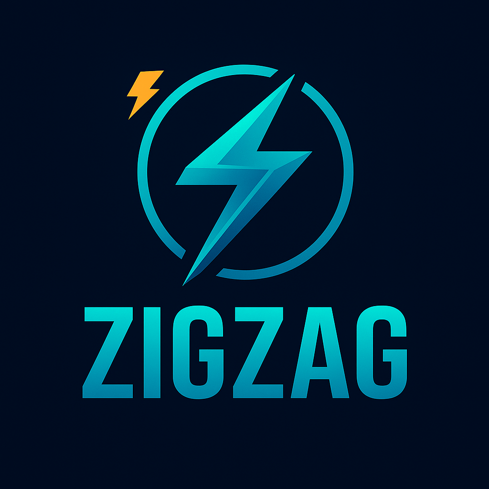

<p align="center">
  
</p>

# zigzag

[](https://ziglang.org/)
[](https://github.com/yourusername/zigzag)
[](https://github.com/yourusername/zigzag)
[](https://github.com/yourusername/zigzag)
[](https://github.com/yourusername/zigzag)
[](https://github.com/yourusername/zigzag)
[](https://github.com/yourusername/zigzag)
[](https://github.com/yourusername/zigzag)

**Lightning-fast, cross-platform event loop for Zig - optimized for terminal emulators with seamless async runtime integration.**

> ⚠️ **EXPERIMENTAL LIBRARY - FOR LAB/PERSONAL USE**
> This is an experimental library under active development. It is intended for research, learning, and personal projects. The API is subject to change and should not be used in production environments without thorough testing and understanding of its limitations.

## ✨ Features

- 🚀 **Maximum Performance**: io_uring backend with zero-copy I/O operations
- 🔄 **Cross-Platform**: Linux (io_uring/epoll), macOS (kqueue), Windows (IOCP)
- 🖥️ **Terminal Optimized**: Built-in PTY management, signal handling, and event coalescing
- ⚡ **Async Ready**: Seamless integration with zsync async runtime
- 🛡️ **Memory Safe**: Zig's compile-time guarantees prevent memory corruption
- 🔒 **Lock-Free**: Single-threaded design eliminates synchronization overhead
- 📦 **Drop-in Replacement**: Compatible API with libxev

## 📦 Installation

### Using Zig Package Manager

```bash
# Add zigzag to your project
zig fetch --save https://github.com/ghostkellz/zigzag/archive/refs/heads/main.tar.gz
```

Then add to your `build.zig.zon`:

```zig
.dependencies = .{
    .zigzag = .{
        .url = "https://github.com/ghostkellz/zigzag/archive/refs/heads/main.zip",
        .hash = "zigzag-main-hash-here",
    },
},
```

### Manual Installation

```bash
git clone https://github.com/ghostkellz/zigzag.git
cd zigzag
zig build
```

## 🚀 Quick Start

```zig
const std = @import("std");
const zigzag = @import("zigzag");

pub fn main() !void {
    // Initialize allocator
    var gpa = std.heap.GeneralPurposeAllocator(.{}){};
    defer _ = gpa.deinit();
    const allocator = gpa.allocator();

    // Create event loop with auto-detected backend
    var loop = try zigzag.EventLoop.init(allocator, .{});
    defer loop.deinit();

    // Add a timer
    const timer = try loop.addTimer(1000, true, timerCallback, null);
    defer loop.cancelTimer(timer);

    // Run the event loop
    try loop.run();
}

fn timerCallback(timer: *const zigzag.Timer) void {
    std.debug.print("Timer fired!\n", .{});
}
```

## 📚 Usage Examples

### File Descriptor Watching

```zig
// Watch a socket for incoming connections
try loop.addFd(server_fd, .{ .read = true }, acceptCallback, &server);

// Handle incoming connections
fn acceptCallback(watch: *const zigzag.Watch, event: zigzag.Event) void {
    if (event.type == .read_ready) {
        const client_fd = std.posix.accept(event.fd, null, null) catch return;
        // Handle new connection...
    }
}
```

### Terminal Signal Handling

```zig
const terminal = @import("terminal.zig");

// Setup signal handler for window resize
var signal_handler = try terminal.SignalHandler.init(&loop);
defer signal_handler.close();
try signal_handler.register();

// Event coalescing prevents resize event spam
var coalescer = try terminal.EventCoalescer.init(allocator);
defer coalescer.deinit();
```

### Timer Management

```zig
// One-shot timer
const timeout = try loop.addTimer(5000, false, timeoutCallback, user_data);

// Recurring timer
const heartbeat = try loop.addTimer(1000, true, heartbeatCallback, null);

// Cancel when done
defer loop.cancelTimer(timeout);
defer loop.cancelTimer(heartbeat);
```

## 🏗️ Architecture

### Backend Selection

zigzag automatically selects the optimal backend for your platform:

| Platform | Primary Backend | Fallback | Performance |
|----------|----------------|----------|-------------|
| Linux 5.1+ | io_uring | epoll | 🚀 Maximum |
| Linux <5.1 | epoll | - | ⚡ High |
| macOS | kqueue | - | ⚡ High |
| Windows | IOCP | - | 🚀 Maximum |

### Event Processing

```zig
// Non-blocking poll
var events: [64]zigzag.Event = undefined;
const count = try loop.poll(&events, 10); // 10ms timeout

// Process events
for (events[0..count]) |event| {
    switch (event.type) {
        .read_ready => handleRead(event),
        .write_ready => handleWrite(event),
        .timer_expired => handleTimer(event),
        .window_resize => handleResize(event),
        else => {},
    }
}
```

## 🔧 API Reference

### Core Types

- **`EventLoop`**: Main event loop structure
- **`Event`**: I/O or timer event
- **`EventMask`**: File descriptor event mask
- **`Timer`**: Timer handle
- **`Watch`**: File descriptor watch handle

### Key Methods

- **`EventLoop.init()`**: Create event loop
- **`addFd()`**: Watch file descriptor
- **`addTimer()`**: Schedule timer
- **`poll()`**: Non-blocking event polling
- **`run()`**: Run event loop

See [`docs/API.md`](docs/API.md) for complete API documentation.

## 🧪 Testing

```bash
# Run all tests
zig test src/root.zig

# Run terminal tests
zig test src/terminal.zig

# Run with specific backend
zig test src/root.zig -Dbackend=io_uring
```

## 📊 Performance

zigzag is designed for maximum performance:

- **Zero-copy I/O** with io_uring
- **Event batching** reduces system calls
- **Timer wheel** for O(1) timer operations
- **Event coalescing** prevents event spam
- **Single-threaded** design eliminates locks

### Benchmarks

*Coming soon - performance comparison with libxev*

## 🤝 Integration

### With zsync (Async Runtime)

```zig
// zigzag integrates seamlessly with zsync
const zsync = @import("zsync");

// Create async task that uses zigzag events
const task = try zsync.spawn(async {
    while (true) {
        const event = try zigzag.waitForEvent();
        // Process event asynchronously
    }
});
```

### Terminal Emulator Integration

```zig
// Perfect for terminal emulators
const terminal = @import("terminal.zig");

// PTY management
var pty = try terminal.Pty.create();
defer pty.close();

// Signal handling for resize/child events
var signals = try terminal.SignalHandler.init(&loop);
try signals.register();

// Coalesce resize events
var coalescer = terminal.EventCoalescer.init(allocator);
```

## 🛠️ Building

### Development Build

```bash
git clone https://github.com/ghostkellz/zigzag.git
cd zigzag

# Build library
zig build

# Run tests
zig test src/root.zig

# Build examples
zig build examples
```

### Integration in Your Project

```zig
// build.zig
const zigzag = b.dependency("zigzag", .{});
exe.root_module.addImport("zigzag", zigzag.module("root"));
```

## 📋 Requirements

- **Zig**: 0.16.0-dev or later
- **Linux**: 2.6.27+ (epoll), 5.1+ (io_uring)
- **macOS**: 10.12+ (kqueue)
- **Windows**: Coming soon (IOCP)

## 🤝 Contributing

1. Fork the repository
2. Create a feature branch
3. Add tests for new functionality
4. Ensure all tests pass
5. Submit a pull request

### Development Setup

```bash
git clone https://github.com/ghostkellz/zigzag.git
cd zigzag

# Install development dependencies
zig fetch --save https://github.com/ghostkellz/zsync/archive/main.zip

# Run tests
zig test src/
```

## 📄 License

Licensed under the MIT License. See [LICENSE](LICENSE) for details.

## 🙏 Acknowledgments

- Inspired by libxev and libev
- Built with the amazing Zig programming language
- Part of the Ghostshell terminal ecosystem

## 📞 Support

- **Issues**: [GitHub Issues](https://github.com/ghostkellz/zigzag/issues)
- **Discussions**: [GitHub Discussions](https://github.com/ghostkellz/zigzag/discussions)
- **Documentation**: [`docs/`](docs/) directory

---

<p align="center">
  <strong>⚡ Built with Zig</strong>
</p>


