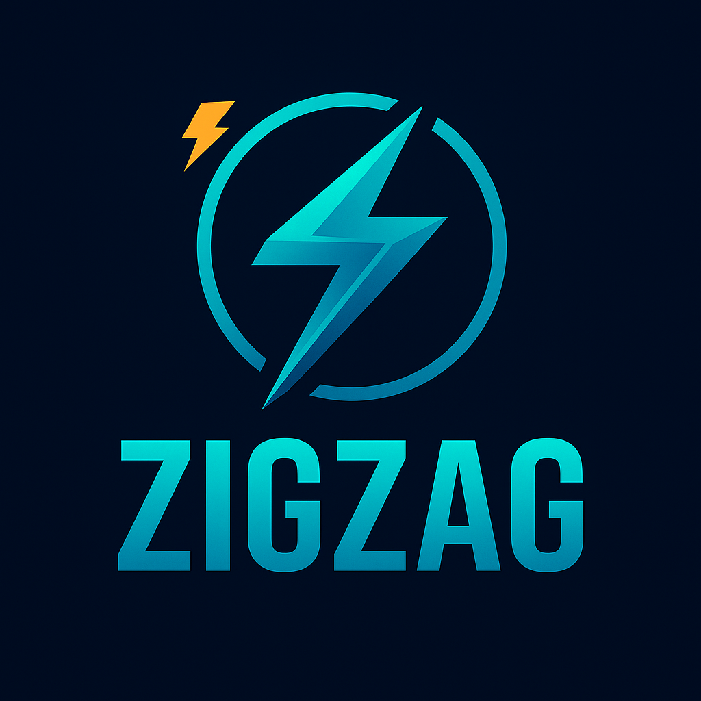

<p align="center">
  
</p>

# ZigZag

<p align="center">
  
  
  
  
  
  
  
  
  
  
  
</p>

High-performance, cross-platform event loop for Zig. Optimized for terminal emulators with seamless async runtime integration.

> **Note**: Experimental library under active development. API may change.

## Features

- **Multi-backend**: io_uring (Linux 5.1+), epoll (Linux), kqueue (macOS/BSD)
- **Terminal optimized**: PTY management, signal handling, event coalescing
- **Async integration**: Experimental zsync runtime helpers
- **Zero-copy I/O**: High-performance I/O operations with io_uring
- **Memory safe**: Zig's compile-time guarantees

## Installation

### Using Zig Package Manager

```bash
# Latest release
zig fetch --save https://github.com/ghostkellz/zigzag/archive/refs/tags/v0.1.6.tar.gz

# Or main branch
zig fetch --save https://github.com/ghostkellz/zigzag/archive/refs/heads/main.tar.gz
```

Add to your `build.zig`:

```zig
const zigzag = b.dependency("zigzag", .{
    .target = target,
    .optimize = optimize,
});
exe.root_module.addImport("zigzag", zigzag.module("zigzag"));
```

### Manual

```bash
git clone https://github.com/ghostkellz/zigzag.git
cd zigzag
zig build
```

## Quick Start

```zig
const std = @import("std");
const zigzag = @import("zigzag");

pub fn main() !void {
    var gpa = std.heap.GeneralPurposeAllocator(.{}){};
    defer _ = gpa.deinit();
    const allocator = gpa.allocator();

    // Create event loop with auto-detected backend
    var loop = try zigzag.EventLoop.init(allocator, .{});
    defer loop.deinit();

    std.debug.print("Backend: {}\n", .{loop.backend});
}
```

## Backend Selection

ZigZag automatically selects the optimal backend:

| Platform | Primary | Fallback |
|----------|---------|----------|
| Linux 5.1+ | io_uring | epoll |
| Linux <5.1 | epoll | - |
| macOS/BSD | kqueue | - |
| Windows | iocp | - |

**Windows Note:** Windows support remains experimental for `v0.1.6`. The IOCP backend currently covers timers, wake/user events, and WinSock socket I/O. Generic `EventLoop.addFd()` is not supported on Windows, file watching uses a caller-driven polling fallback, and we have not yet run runtime verification on a real Windows host.

## Build Options

```bash
# Disable specific backends
zig build -Dio_uring=false
zig build -Depoll=false
zig build -Dkqueue=false

# Enable debug events
zig build -Ddebug_events=true
```

## Documentation

- [API Reference](docs/api/README.md)
- [Quick Start Guide](docs/guides/quickstart.md)
- [Performance](docs/performance/README.md)

## Requirements

- Zig 0.17.0-dev or later
- Linux 2.6.27+ (epoll) or 5.1+ (io_uring)
- macOS 10.12+ (kqueue)
- Windows 11 (IOCP)

## Contributing

See [CONTRIBUTING.md](CONTRIBUTING.md) for guidelines.

## License

MIT License. See [LICENSE](LICENSE).
